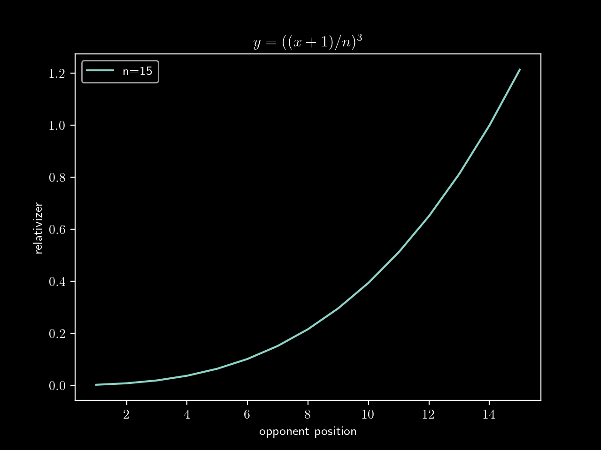
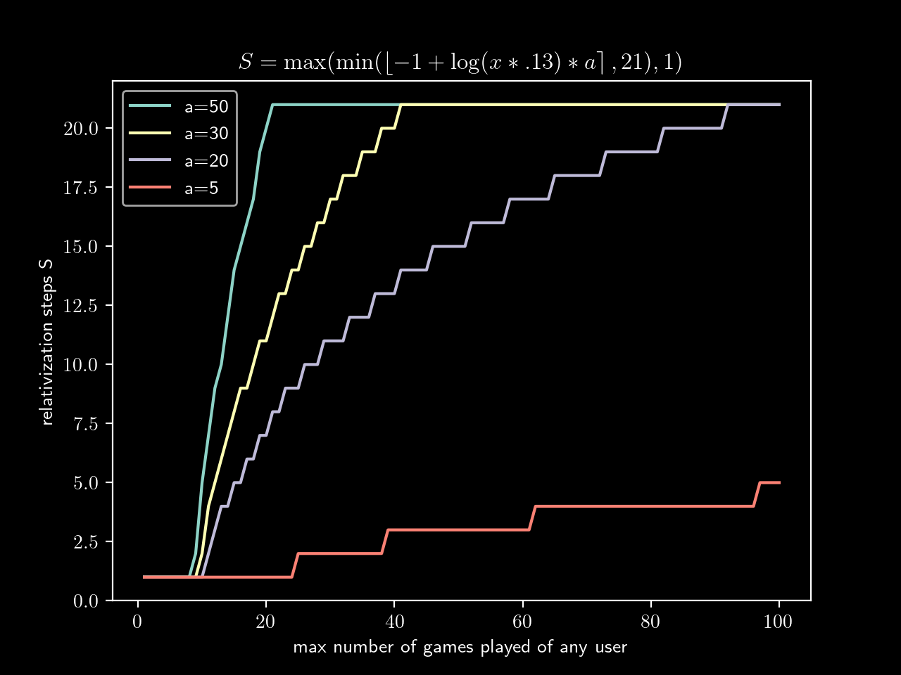

# Relative Ranking System

Ranking system for ladder rankings where games are won in best out of X rounds.

## Implementation

The relative ranking system is currently implemented in PHP as part of
[Worms League](https://github.com/Zemke/worms-league).

## Problem

In the public world one is accustomed to absolute ranking system.
These are self-contained perfect.
Everyone plays everyone the same amount of times.
Therefore there's no need in complexity to assess a points pattern other than
addition.
The fixtures are inherently perfect.

This is not typically the case in online games where there's to fixed schedule
and not everyone is necessarily playing everyone the same amount of times.
So players may never clash, others multiple times.
An absolute ranking would make players end up top who win most of their games.
In other words, possible the most active or the one playing the weakest players.

## Solution

Therefore the series of a user has to be evaluated within a context that's
**relative** to all the other contenders in.

The most blatant example is a victory against a higher ranked other player
should get one more points than against a lower ranked player.

## Increasingly Relative

In a relative ranking system the points of a user are determined by the points
of the opponents one has played against.
The question is how to you initially determine the points of another user when
they are not yet ranked.

### Starting Absolute

The most fundamental information that an absolute ranking could be generated
from is the total won rounds.
One gets one points per won round.

This is now an absolute state.
The idea of the relative ranking system is to put this absolute rating of each
players into perspective — into context.

### Relativizers

Looking at the number of won rounds of each player under which circumstances
were they actually attained? \
One is more likely to add won rounds based on these factors:

* level of opponents (`quality`)
* number of rounds (`farming`)
* total number of rounds (`effort`)

These three factors are relative among themselves again.
For instance the more number of rounds against the same opponent of a weaker
skill level, the more likely one is to gain won rounds and vice versa. \
If one is generally playing for rounds, it's more likely to accumulate won
rounds, too.

These are the three main factors used in the relative ranking system.
These can be referenced to put the absolute value of won rounds into a context.
Therefore they relativize an absolute number and are thus called "relativizers."

#### `quality`

The `quality` relativizer relativizes won rounds in the context of how well the
opponents of that user are rated.
This is perhaps the most obvious relativizer valuing won rounds according to the
rating of the respective opponent.

$o$ = Number of opponents \
$n$ = Distinct ratings of all all users \
$n_i$ = Position of opponent in $n$ \
$w_i$ = Won rounds against opponent \
$t$ = Total won rounds

$$ \sum_{i=1}^{o}{((n_i+1)/n)^3 * w_i/t} $$

This is averaged so that number of rounds per opponent are accounted for
proportionally.

Here is the opponent's position to relativization plot for a total of $n=16$
distinct ratings.

The highest rated player -- being at position 16 in $n$ -- is worth a 100
percent so that the result for $max(n)$ is always $1$.
Won rounds are exponentially less relativized the higher the opponent is rated.

Exponential makes sense here because ratings for players at the top tend to be 
more robust.
For example the difference in skill of a player is likely to be greater between
first and third place than it is for 20th and 23rd.

#### `farming`

The `farming` relativizer relativizes won rounds in the context of how often
that user played against the same opponent.
Each won round weighing less than the previous.
This retaliates the infamous "noob bashing" where a better
player repeatedly defeats a very low rated player to farm points from.

Additionally this promotes users to have diverse pairings.
Certainly a user's rating is easier to assess the more data is available. \
Theoretically you can gain more points from defeating a low rated player for the
first time than gaining a bazillionth won round against a high rated player.

The relativizer is made so that per opponent the first round is always worth $1$
as in 100 percent.
Then the value of each next won round decreases logarithmically.
The logarithm is negative natural.
It decreases until $0.01$ which is the least value a round can have as per the
`farming` relativizer.
It is given to the round of the maximum won rounds any player has against another.
This value is $a$.

This is the important concept here.
Scaling the value of won rounds from $1$ to $0.01$ negatively logarithmically.

Starting with the fundamental logarithmic function:

$$ y=-ln(x)+1 $$

TODO PLOT

Adding $1$ controls where $y$ intercepts at $x=1$.
Let's make it variable to make it more clear: $y=-ln(x)+k$
It is desired to make it so that when $x=1$ and $k=1$ then $y$ should resolve
to $1$.
This is because $x$ is the round and the first round should always be valued at
a 100 percent, $1$ respectively.

Now the curve needs to be adjusted so that $y=0.01$ when $x=a$.
Since $-ln(x)+1 = -z * ln(x)+1$ where $a=1$, it can resolve for $z$ for when
$y=0.01$.

$$ 0.01=-z * ln(x)+1 $$

$$ z={99 \over 100ln(a)} $$

The formula ends up like this:

$$ y = -{99 \over {100 ln(a)}}ln(x)+1 $$

The boundaries are for the first round

$$ a=x \to y=0.01 $$

and maximum round respectively

$$ x=1 \to y=1 $$

with everything in between decreasing towars $0.01$ logarithmically.

$$ -(99/(100ln(a)))ln(x)+1 $$

TODO PLOT

This formula is applied to each round so that $x$ is a set where each number
represents the $n$-th won round.

$$ X = \lbrace 1, 2, 3, 4, ... \rbrace $$

This is added and divided by the total number of rounds against that opponent.
This is the average.

$$ {-{99 \over {100 ln(a)}}ln(x)+1} \over z $$

This is the per opponent and yet again averaged across all opponents.
The final formula to output the factor of relativization:

$$ \sum_{i=1}^{o}{{\sum_{x=1}^{z}{-{99 \over {100 ln(a)}}ln(x)+1} \over z} * w_i/t} $$

#### `effort`

The `quality` relativizer relativizes won rounds in the context of how many
rounds in total were played to attain the portion of won rounds.

### Relativization Steps

Each calculation of a relative ranking starts with an absolute ranking.
They're put into relation using relativizers.

Since two perspectives -- an absolute and a relative -- are put against each
other, it is necessary to balance them out.

The more relativity is "applied" to the absolute information, the less the
original absolute value has any weight in the final outcome.
Potentially leading to an entirely unfounded result as the relativization
process to relativize itself more and more.

The relative ranking system applies relativization steps. With each new
step the previous value is relativized further. Each output is the input
of the next step. As aforementioned the initial input is the absolute value of
won rounds.

Each step is the same relativization algorithm applied to the input.

#### Configuration

To further fine-tune the balancing of relativization relative ranking system
uses two configuration parameters.

##### `relSteps`

`relSteps` is used in a formula to determine the total number of relativization
steps. \
Consider $a$ to be `relSteps` and $x$ is the maximum total number of
steps played of any user.

$$ S = \max(\min(\left\lfloor -1+\log(x*.13)*a \right\rceil,21),1) $$

`S` is solved for the number of relativization steps to take.

Assuming `relSteps` is $36$, it would generate the following relativization
steps per maximum rounds played of any user.

The user with the maximum number of rounds played on the y-axis and what number
of relativization steps it would cause on the y-axis.

The graph shows how the number of steps rises logarithmically.
The greater `relSteps` the steeper the rise.
Hence a greater `relSteps` factor causes the relativization to be more effect
thus weighing in more in the balancing ob the absolute number versus the
relativized result.

There has got to be at least one relativization step and $21$ at most.
The result is rounded down.

$20$ for the $relSteps$ parameter and maxing out at $21$ have proven to deliver the
best results.
More on that later.

##### `relRel`

`relRel` is used in a formula to influence the impact of each individual
relativization step.

A relativizer returns a decimal that the number to be relativized is multiplied
with.
The number to be relativized is always the current rating of that user.
In the first relativization step that is the absolute number of won rounds of
that user in all subsequent steps it is the rating of that user.

In other words: Prior to any relativization, the rating of a user is simply
that user's won rounds, in all subsequent steps it is the relativization
result of the previous step.
In the first step the won rounds are relativized and that result is to be
relativized in the next step and so on and so forth.

In that example the three won rounds of a user are passed through four
relativization steps determining the final rating of the user.

$$ 3 * 0.83 * 1.2 * 0.5 * 3.2 = 1.7808 $$

Here the decimals $0.83$, $1.2$, $0.5$ and $3.2$ represent a step of
relativization each. The greater the difference to $1$ the greater the impact
of relativization as $1$ would not impact the result at all.

Here `relRel` configuration comes into play.
It is added to the relativizationland then the average of these result in the
final relativization.

In practice the average of three relativizers (as mentioned earlier) and
`relRel` form the final decimal that the rating of the current step is 
relativized by.

Therefore within reach step the rating of the previous round is multiplied by
the average of all the relativizers including `relRel` to form the new rating
which is the final rating depending on whether all steps have completed.

$$ R_i = R_{i-1} * {\sum_{k=1}^{3}{rel_k} + a \over 4} $$

